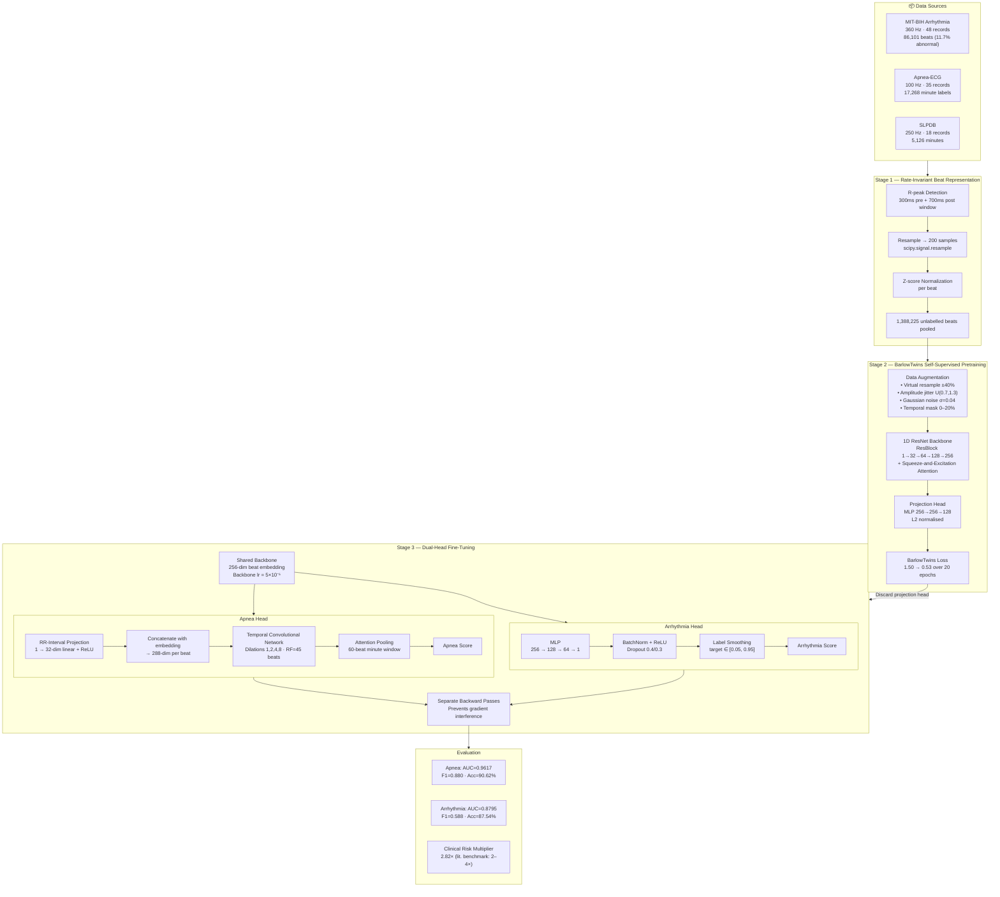

# 🫀 Multi-Task ECG Analysis: Sleep Apnea & Cardiac Arrhythmia Detection

> **Rate-Invariant Self-Supervised Pretraining for Simultaneous OSA and Arrhythmia Detection from Single-Lead ECG**

[](https://doi.org/10.1109/ACCESS.2023.DOI)
[](https://www.python.org/)
[](https://pytorch.org/)
[](LICENSE)

---

## 📋 Overview

This repository contains the implementation of a novel **multi-task deep learning framework** that simultaneously detects **Obstructive Sleep Apnea (OSA)** and classifies **Cardiac Arrhythmias** from a single-lead ECG signal — without any manual feature engineering or multi-sensor setups.

The core innovation is **rate-invariant self-supervised pretraining** via **Barlow Twins** contrastive learning, enabling a single model to train across three heterogeneous ECG databases with different sampling rates (100 Hz, 250 Hz, 360 Hz).

| Task | AUC | F1 | Accuracy |
|---|---|---|---|
|  Sleep Apnea Detection | **0.9617** | 0.880 | 90.62% |
|  Arrhythmia Classification | **0.8795** | 0.588 | 87.54% |

---

## 🏗️ System Architecture



---

## ✨ Key Contributions

- **Rate-Invariant Beat Representation** — All beats resampled to a uniform 200-sample physiological grid, eliminating cross-database sampling-rate mismatch.
- **BarlowTwins SSL Pretraining** — 1D ResNet pretrained on 1.38M unlabelled beats; virtual resampling augmentation (±40%) ensures robustness to sampling-rate domain shifts.
- **RR-Interval Augmented Apnea Head** — RR intervals projected and concatenated with beat embeddings, directly exposing the TCN to HRV patterns associated with apnea arousals.
- **Attention Pooling** — Replaces average pooling; learns per-beat weights over a 60-beat (1-minute) window to focus on discriminative apnea events.
- **Dual-Head Fine-Tuning with Separate Backward Passes** — Prevents gradient conflicts between the two tasks without requiring separate models.
- **Per-Patient Clinical Risk Multiplier** — Apnea–arrhythmia co-occurrence factor of **2.82×** (patient slp14), consistent with the literature benchmark of 2–4×.

---

##

## 🗄️ Datasets

All datasets are publicly available via [PhysioNet](https://physionet.org/).

| Database | Hz | Records | Annotation | Use |
|---|---|---|---|---|
| [MIT-BIH Arrhythmia](https://physionet.org/content/mitdb/) | 360 | 48 | Beat-level AAMI EC57 | Arrhythmia head |
| [Apnea-ECG](https://physionet.org/content/apnea-ecg/) | 100 | 35 | Minute-level apnea/normal | Apnea head |
| [SLPDB](https://physionet.org/content/slpdb/) | 250 | 18 | Apnea + beat annotations | Risk multiplier |

Download and place under `data/raw/` before running preprocessing.

---


**Core dependencies:** PyTorch · NumPy · SciPy · scikit-learn · wfdb · matplotlib

---


## 📊 Results

### Performance vs. Pre-defined Targets

| Metric | Target | Achieved | Status |
|---|---|---|---|
| Apnea AUC | > 0.85 | **0.9617** | ✅ Exceeded |
| Apnea Accuracy | > 85% | **90.62%** | ✅ Exceeded |
| Arrhythmia AUC | > 0.85 | **0.8795** | ✅ Met |
| Arrhythmia Accuracy | > 80% | **87.54%** | ✅ Exceeded |
| Clinical Risk Multiplier | 2–4× | **2.82×** | ✅ Partial |

### Comparison with Prior Work

| Reference | Method | Task | AUC / Accuracy |
|---|---|---|---|
| Song et al. (2016) | Discriminative HMM | Apnea | 97.1% acc |
| Liang et al. (2025) | Multi-scale CNN | Apnea | AUC 0.928 |
| Anoiri et al. (2025) | CNN + RNN Hybrid | Arrhythmia | F1 0.978 |
| Anand et al. (2025) | VGG16 Transfer | Arrhythmia | ~99.8% acc |
| **Ours** | **BarlowTwins + ResNet + TCN** | **Both (single-lead)** | **AUC 0.9617 / 0.8795** |

>  Prior works address each task independently. This is the **first system** to jointly solve both from a single-lead ECG.

---

## 🔬 Model Configuration

| Hyperparameter | Value |
|---|---|
| Beat window | 200 samples (300ms pre + 700ms post R-peak) |
| SSL corpus | 1,388,225 beats |
| Pretraining epochs | 20 |
| Pretraining optimizer | AdamW, lr=1e-3, wd=1e-4 |
| Fine-tuning epochs | 40 (early stop patience=10) |
| Backbone lr | 5×10⁻⁵ |
| Head lr | 3×10⁻⁴ |
| TCN dilations | 1, 2, 4, 8 (RF = 45 beats) |
| Attention window | 60 beats / 1 minute |
| Arrhythmia threshold | 0.242 |
| Apnea threshold | 0.139 |

---

## 📄 Citation

If you use this code or build upon this work, please cite:

```bibtex
@article{krishna2023multitask,
  title   = {Multi-Task Deep Learning for Simultaneous Sleep Apnea and Cardiac
             Arrhythmia Detection from Single-Lead ECG Using Rate-Invariant
             Self-Supervised Pretraining},
  author  = {Sekar, Pragya and Krishna, Sai and V, Sowmiya and A K, Ilavarasi},
  journal = {IEEE Access},
  volume  = {11},
  year    = {2023},
  doi     = {10.1109/ACCESS.2023.DOI}
}
```

---

## 🔭 Future Work

- Incorporate concurrent SpO₂ data for hypoxia-driven arrhythmia identification
- Break the arrhythmia head into per-AAMI-category sub-heads (V, S, F, Q)
- Prospective validation on consumer wearables (Apple Watch, Withings)
- Scale SSL pretraining to tens of millions of beats (PhysioNet, UK Biobank)
- Hierarchical attention for variable-length recordings

---

## 👥 Authors

**Pragya Sekar · Sai Krishna · Sowmiya V · Ilavarasi A K**  
School of Computer Science, VIT Chennai, Tamil Nadu, India

---

<p align="center">Made with ❤️ at VIT Chennai</p>
